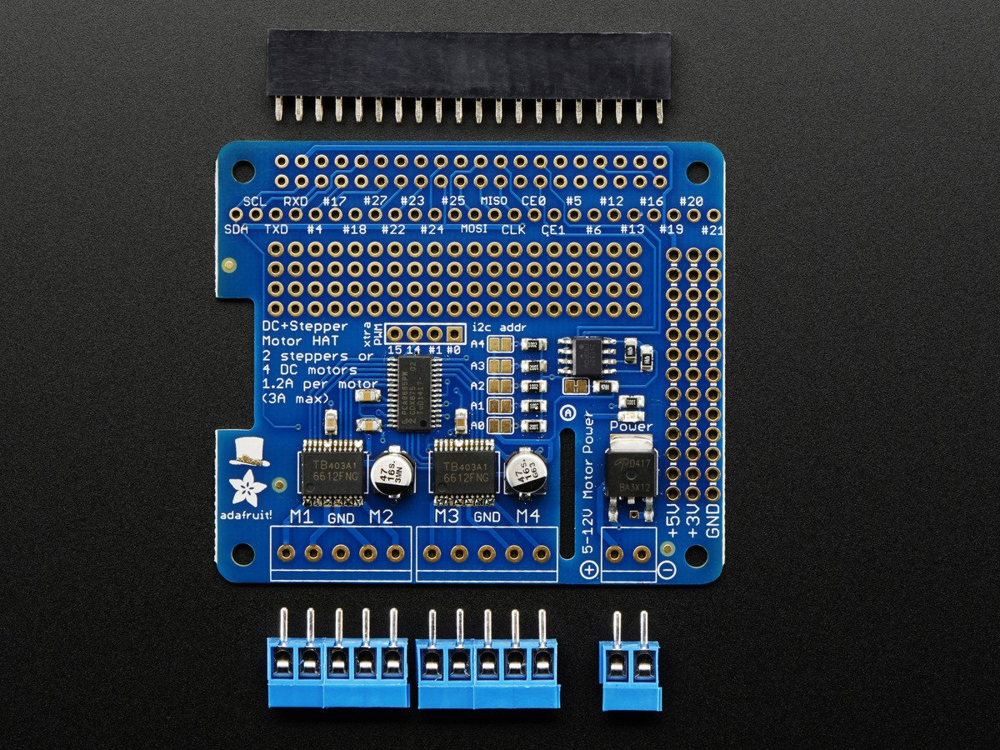
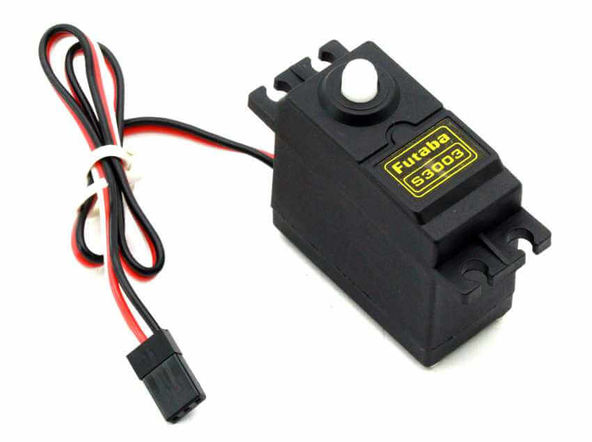
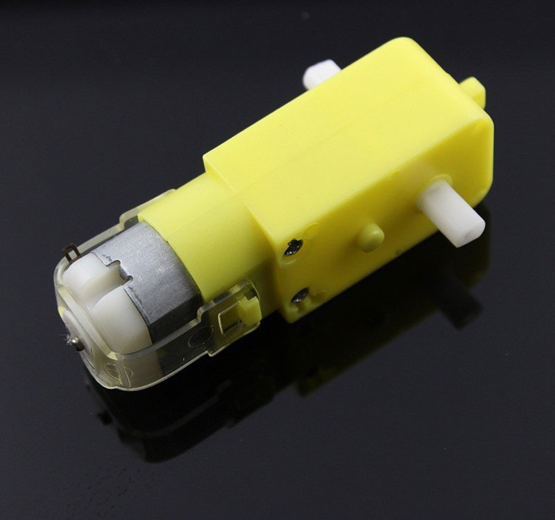

# SmartMobileObject RPI3B+

# 1st floor(Hwiyong Chang) - Steering device(3Dprinter), DC motor(Adafruit DC & Stepper Motor HAT) and ultrasonic(RPI)

### Devices
#### Raspberry Pi 3 Model B+

#### Adafruit DC & Stepper Motor HAT

#### HC-SR04 x6

#### Servo Motor x1 (Steering)

#### DC Motor x2 (Forward, Backward)

# 2nd floor(GangHo Lee) - Camera(RPI)

# 3rd floor(Inuk Choi) - Lidar(RPI)
