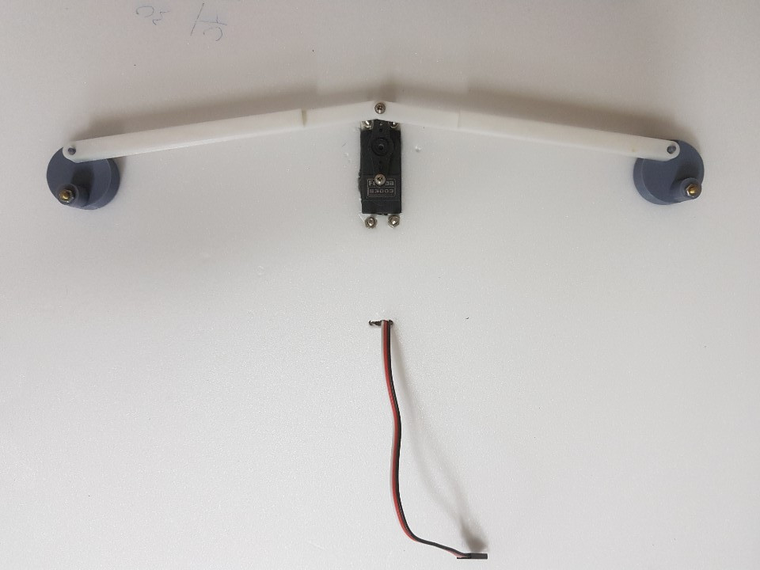
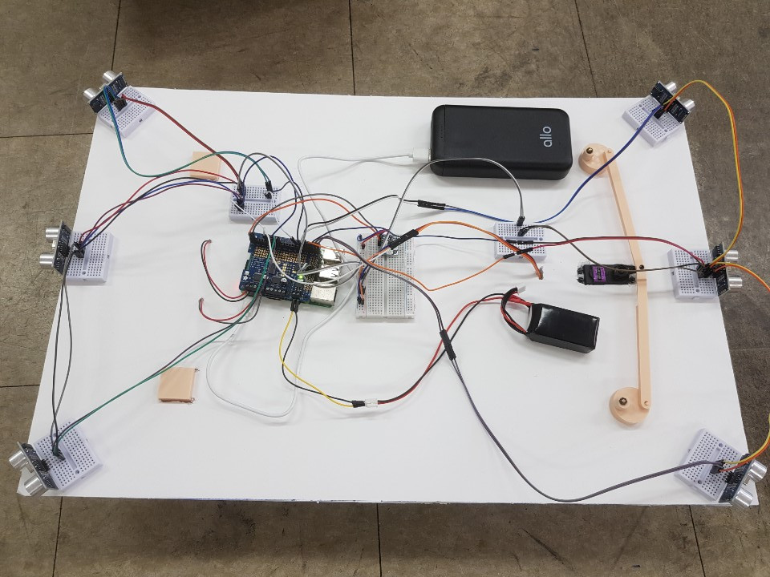

# **SmartMobileObject RPI3B+**

## 1st floor(Hwiyong Chang) - Steering device(3Dprinter), DC motor(Adafruit DC & Stepper Motor HAT) and ultrasonic(RPI)

### 1.Devices
#### Raspberry Pi 3 Model B+ x1

#### 2.Adafruit DC & Stepper Motor HAT x1

#### 3.HC-SR04 x6

#### 4.Servo Motor x1 (for Steering)

#### 5.DC Motor x2 (Forward, Backward)

#### Complete : Steering Device

#### Complete : Smart Moblie Object (Top view)

#### Complete : Smart Moblie Object (Side view)

### Software
Ras

## 2nd floor(GangHo Lee) - Camera(RPI)

## 3rd floor(Inuk Choi) - Lidar(RPI)
