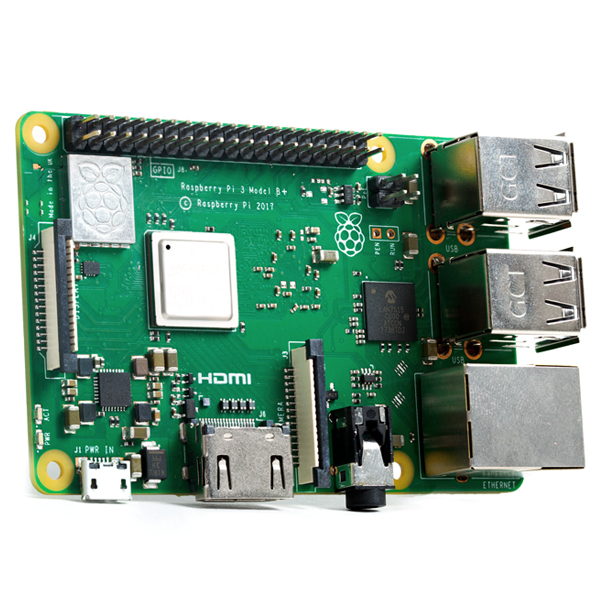

# **SmartMobileObject RPI3B+**

## 1st floor(Hwiyong Chang) - Steering device(3Dprinter), DC motor(Adafruit DC & Stepper Motor HAT) and ultrasonic(RPI)

### Smart Moblie Object 2.4 (1st floor)

#### Top view

#### Side view

### Devices
#### 1. Raspberry Pi 3 Model B+ x1

### Smart Moblie Object 2.4 (1st floor)

#### 2. Adafruit DC & Stepper Motor HAT x1 (RPI shield)

#### 3. HC-SR04 x6 (ultrasonic sensor)

#### 4. Servo Motor x1 (for Steering)

#### 5. DC Motor x2 (Forward, Backward)

#### Complete : Steering Device (Using 3D printer)

### Software 

#### Configuration
##### install Raspbian in Raspberry Pi
**pi@raspberrypi:~$** sudo apt update
**pi@raspberrypi:~$** sudo apt upgrade
**pi@raspberrypi:~$** sudo apt install libbluetooth-dev
**pi@raspberrypi:~$** sudo apt install gedit
**pi@raspberrypi:~$** sudo gedit /etc/systemd/system/dbus-org.bluez.service

#### Excute
**pi@raspberrypi:~$** git clone https://github.com/CDVIIXV/SmartMobileObject-RPI3Bplus
**pi@raspberrypi:~$** cd SmartMobileObject-RPI3Bplus/
**pi@raspberrypi:~SmartMobileObject-RPI3Bplus/$** cd Move/
**pi@raspberrypi:~SmartMobileObject-RPI3Bplus/$** sudo apt install libbluetooth-dev
**pi@raspberrypi:~SmartMobileObject-RPI3Bplus/Move/$** gcc -o auto.o auto.c dc_motor.c servo_motor.c ultrasonic.c bluetooth.c -lwiringPi -lbluetooth -lpthread
**pi@raspberrypi:~SmartMobileObject-RPI3Bplus/Move/$** sudo ./auto.o

## 2nd floor(GangHo Lee) - Camera(RPI)

## 3rd floor(Inuk Choi) - Lidar(RPI)
